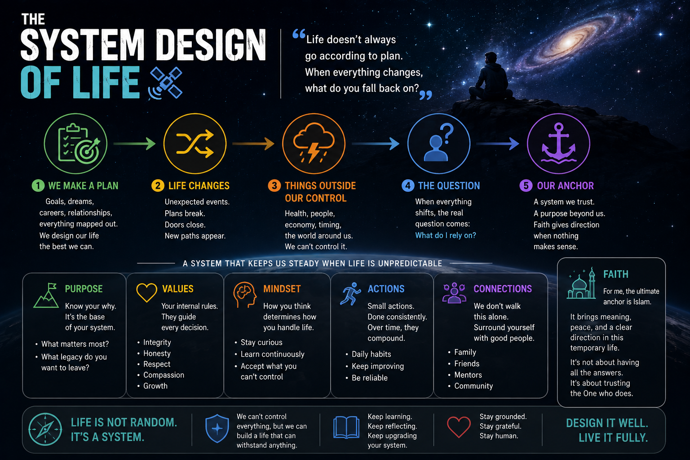

# 🛰️ The System Design of Life

> **Life doesn't always go according to plan. When everything changes,
> what do you fall back on?**

I'm not a religious scholar.

I'm not the most religious person either.

I'm just someone who looks at life and this universe and thinks:

**There has to be more to all this.**
---

---

## 🌌 Ever Thought About It?

The universe follows rules.

Gravity works. Nature follows cycles. Our bodies keep running without us
thinking about it.

And somehow, we're here.

Science has taught us an incredible amount about **how** things work.

But some questions remain:

> **Why does anything exist?**\
> **Does life have a purpose?**\
> **Is there a Creator?**\
> **What happens when this life ends?**

I don't pretend to have every answer.

But I think the questions are worth asking.

------------------------------------------------------------------------

## 🎮 Then Life Happens

Most of us have some kind of plan:

**Study → Work → Money → Family → Retire**

Looks good.

Then life goes:

> **"Can is can... but wait first."** 😂

A job disappears.

Money gets tight.

A relationship ends.

Someone becomes sick.

Someone you love is suddenly gone.

Something you've worked years for doesn't happen.

That's when you realise:

**We control much less than we think.**

------------------------------------------------------------------------

## ⚓ What Do You Hold On To?

Family matters.

Friends matter.

Money matters.

Professional help matters.

But sometimes we're left asking:

> **"Why is this happening?"**

> **"How do I accept something I cannot change?"**

That's where I believe **faith can become an anchor**.

Faith doesn't magically solve your problems.

You still work.\
You still seek help.\
You still go to the doctor.\
You still solve what you can.\
You still try again.

Faith simply gives you something to hold onto while you do it.

------------------------------------------------------------------------

## 🧠 Question What You Believe

Maybe you grew up Muslim.

Maybe Christian, Buddhist or Hindu.

Maybe you're atheist or agnostic.

Maybe you honestly don't know.

Whatever your background, ask yourself:

> **"Do I believe this because I've thought about it --- or simply
> because this is what I grew up with?"**

Read. Ask. Compare. Think.

You don't need to solve the meaning of life tonight.

**Tomorrow still got work.** 😂

Just start with:

**Why are we here?**

**Could there be a Creator?**

**Does my life have a purpose?**

**What do I actually believe --- and why?**

Not your parents.

Not your friends.

Not social media.

**You.**

------------------------------------------------------------------------

## ☪️ Where My Search Leads

For me, it leads to **Islam**.

Not because I have everything figured out.

I don't.

And not because being Muslim automatically makes someone a better
person.

It doesn't.

What speaks to me is the simplicity at its centre:

> **There is one Creator.**

No human being is God.

Money isn't God.

Career isn't God.

Status isn't God.

And everything we have in this life is temporary.

When life is going well, that's easy to forget.

When life isn't going well, it means much more.

That's where **my** thinking leads.

Yours is something you have to explore for yourself.

------------------------------------------------------------------------

## 🧭 The Simple Logic

**Question → Think → Learn → Understand What You Believe → Find Your
Anchor**

Your anchor doesn't make you immune to life's problems.

You will still struggle.

You will still make mistakes.

There will still be things you cannot control.

But perhaps having something deeper than money, work, status or other
people's approval gives you somewhere to stand when those things
disappear.

------------------------------------------------------------------------

# 💭 One Last Question

I'm not trying to settle thousands of years of religion and philosophy
with a GitHub README.

That would be quite power. 😂

I'm only asking you to think about one thing:

> ## **When the things I normally depend on are no longer enough, what do I still have to hold onto?**

Maybe you already know.

Maybe it's faith.

Maybe you're still searching.

Either way...

**it's probably worth thinking about before you need the answer.**

------------------------------------------------------------------------

## Disclaimer

A personal reflection on life, faith and purpose.

## Credits

**Concept & direction:** Wansaidon\
**Written with:** ChatGPT by OpenAI

------------------------------------------------------------------------

*You don't need every answer.*

***Sometimes you just need to start asking the right questions.***
